# 基于Rust的大模型Windows桌面应用

## 1. 项目概述

​	本章节介绍了项目的基本情况、背景和技术选型。项目旨在构建一个统一的大语言模型导航平台，解决当前AI工具分散、使用体验不一致的问题。通过Rust和Tauri的结合，实现了一个高性能、轻量级的现代桌面应用。

### 1.1 项目简介

​	本项目是一个基于 Rust 开发的 Windows 桌面应用程序，旨在提供一个统一的大语言模型导航平台。项目使用 Tauri 框架作为核心，结合 Rust 后端和 Vue.js 前端，实现了一个现代化的桌面应用程序。

​	在当前AI快速发展的背景下，各类大语言模型和AI工具层出不穷，用户在选择和使用时常常感到困惑。本项目致力于解决这一问题，通过提供一个集中化的导航平台，帮助用户快速找到并使用适合自己需求的AI模型和工具。

​	项目具有以下特点：
- 轻量级：基于 Rust 和 Tauri 开发，应用程序体积小、启动快速
- 高性能：得益于 Rust 的高性能特性，确保应用运行流畅
- 跨平台：虽主要面向 Windows 用户，但架构支持跨平台扩展
- 用户友好：直观的界面设计，简单易用的交互方式
- 可扩展：采用模块化设计，便于后续功能扩展


### 1.2 项目背景

​	近年来，人工智能领域取得了突破性进展，其中大语言模型（Large Language Models, LLMs）的兴起尤为引人注目。大语言模型是基于深度学习技术的自然语言处理（NLP）模型，能够理解和生成人类语言，广泛应用于文本生成、翻译、问答系统、对话系统等多个领域。

​	随着人工智能技术的快速发展，大语言模型已成为改变人们工作和生活方式的重要工具。然而，当前的使用环境存在以下问题：

1. 市场现状

+ 大语言模型平台快速增长

+ 各平台功能特点各异

+ 访问方式分散且不统一

+ 用户体验参差不齐

2. 用户痛点

+ 需要同时打开多个网页或应用

+ 平台切换繁琐耗时

+ 缺乏统一的使用体验

+ 个性化设置难以同步

+ 平台状态无法实时掌握

3. 发展趋势

+ AI 对话需求持续增长

+ 专业化分工日益明显

+ 用户对效率要求提高

+ 个性化需求不断涌现

4. 解决方案

+ 提供统一的桌面端入口

+ 实现便捷的平台切换

+ 支持个性化的使用体验

+ 建立实时的状态监控

+ 打造智能的分类系统

​	本项目正是基于这样的背景，致力于解决用户在使用大语言模型时遇到的各种问题。通过提供一个统一、高效、个性化的桌面应用程序，帮助用户更好地利用 AI 技术，提升工作效率和使用体验。

​	我们期望能够为用户提供一个真正有价值、易用性强、体验优秀的大语言模型导航平台，推动 AI 技术在更广泛领域的应用和发展。

### 1.3 技术栈选择

+ 后端核心：
  + Rust 1.70+ 作为主要开发语言
  + Tauri 1.5 作为桌面应用框架
  + windows-sys 0.48 用于 Windows API 集成

+ 前端技术：
  + Vue.js 3.x 作为前端框架
  + Vite 作为构建工具
  + Tauri API 用于前后端通信

+ 系统要求：
  + Windows 10/11 64位系统
  + 支持现代浏览器内核

### 1.4 项目结构

~~~
project-root/
├── src/                    # 前端源代码
│   ├── components/         # Vue组件
│   │   ├── Home.vue       # 主页组件
│   │   └── Preferences.vue # 偏好设置组件
│   ├── App.vue            # 根组件
│   └── main.js            # 前端入口
├── src-tauri/             # Rust后端代码
│   ├── src/
│   │   ├── lib.rs         # 核心功能实现
│   │   └── main.rs        # 程序入口
│   ├── Cargo.toml         # Rust依赖配置
│   └── tauri.conf.json    # Tauri配置
└── public/                # 静态资源
~~~

## 2. Rust 核心实现

​	本章节详细描述了项目的Rust后端实现，包括窗口管理系统、系统集成、事件处理和安全机制。通过Rust的高性能特性和Tauri框架，实现了与Windows系统的深度集成，确保了应用的性能和安全性。

### 2.1 窗口管理系统

#### 2.1.1 主窗口管理

~~~rust
// src-tauri/src/lib.rs
pub fn run() {
    let main_menu = Menu::new()
        .add_submenu(file_menu)
        .add_submenu(edit_menu)
        .add_submenu(view_menu)
        .add_submenu(help_menu);

    tauri::Builder::default()
        .menu(main_menu)
        .setup(|app| {
            #[cfg(target_os = "windows")]
            {
                // 获取主窗口句柄
                let main_window = app.get_window("main").unwrap();
                let hwnd = main_window.hwnd().unwrap().0 as HWND;
                
                // 设置窗口菜单
                unsafe {
                    let menu = GetMenu(hwnd);
                    MAIN_MENU.store(menu as isize, std::sync::atomic::Ordering::SeqCst);
                }
            }
            Ok(())
        })
}
~~~

#### 2.1.2 偏好设置窗口管理

~~~rust
// 偏好设置窗口创建和管理
"preferences" => {
    let app = win.app_handle();
    let preferences_window = app.get_window("preferences");
    
    match preferences_window {
        Some(window) => {
            // 窗口已存在，显示并聚焦
            window.show().unwrap();
            window.set_focus().unwrap();
        }
        None => {
            // 创建新窗口
            WindowBuilder::new(
                &app,
                "preferences",
                WindowUrl::App("index.html#/preferences".into())
            )
            .title("偏好设置")
            .inner_size(800.0, 600.0)
            .center()
            .build()
            .unwrap();
        }
    }
}
~~~

### 2.2 系统集成

+ Windows API 集成：使用 windows-sys 包实现与 Windows 系统的深度集成

+ 菜单系统：通过 Rust 实现原生菜单栏的管理和控制

+ 窗口装饰：自定义窗口装饰，实现不同窗口类型的差异化处理

#### 2.2.1 Windows API 集成

~~~rust
// Cargo.toml 中的 Windows 依赖配置
[target.'cfg(windows)'.dependencies]
windows-sys = { version = "0.48", features = [
    "Win32_UI_WindowsAndMessaging",
    "Win32_Foundation"
]}
~~~

#### 2.2.2 菜单系统实现

~~~rust
// 菜单创建
let file_menu = Submenu::new(
    "文件",
    Menu::new()
        .add_item(CustomMenuItem::new("preferences", "偏好设置"))
        .add_native_item(MenuItem::Separator)
        .add_item(CustomMenuItem::new("quit", "退出")),
);

// 菜单事件处理
.on_menu_event(|event| {
    match event.menu_item_id() {
        "preferences" => { /* 处理偏好设置 */ }
        "quit" => { std::process::exit(0); }
        "copy" => { win.eval("document.execCommand('copy')").unwrap(); }
        // ... 其他菜单项处理
    }
})
~~~

### 2.3 事件处理系统

#### 2.3.1 窗口事件

~~~rust
.on_window_event(|event| {
    if event.window().label() == "preferences" {
        #[cfg(target_os = "windows")]
        {
            use windows_sys::Win32::UI::WindowsAndMessaging::SetMenu;
            use windows_sys::Win32::Foundation::HWND;
            let hwnd = event.window().hwnd().unwrap().0 as HWND;
            unsafe {
                SetMenu(hwnd, 0); // 移除菜单栏
            }
        }
    }
})
~~~

#### 2.3.2 系统事件处理

~~~rust
// 系统命令处理
"documentation" => {
    let _ = Command::new("cmd")
        .args(["/C", "start", "https://github.com/yourusername/yourrepo/wiki"])
        .spawn();
}
~~~

### 2.4 安全性实现

#### 2.4.1 CSP 配置

~~~rust
// tauri.conf.json 中的安全配置
{
    "security": {
        "csp": "default-src 'self'; connect-src 'self' https://chat.openai.com https://tongyi.aliyun.com https://kimi.moonshot.cn"
    }
}
~~~

#### 2.4.2 权限管理

~~~rust
{
    "allowlist": {
        "all": false,
        "shell": {
            "all": false,
            "open": true
        },
        "window": {
            "all": true,
            "create": true,
            "setTitle": true,
            "show": true,
            "hide": true,
            "close": true,
            "setDecorations": true,
            "setFocus": true
        }
    }
}
~~~

## 3. 功能模块

​	本章节详细介绍了应用的核心功能模块，包括窗口管理、导航系统、主题系统、路由系统等。这些模块共同构建了一个功能完整、用户友好的应用程序，为用户提供了统一的AI工具访问体验。

### 3.1 窗口管理模块

+ 主窗口：实现主导航界面
+ 偏好设置窗口：独立的设置界面，自定义窗口装饰
+ 窗口通信：基于 Tauri 的窗口间通信机制

#### 3.1.1 主窗口实现

~~~rust
// src-tauri/src/lib.rs
// 主窗口配置
{
    "windows": [
        {
            "fullscreen": false,
            "height": 800,
            "resizable": true,
            "title": "LLM导航平台",
            "width": 1200,
            "label": "main"
        }
    ]
}

// 主窗口菜单配置

    .add_submenu(file_menu)
    .add_submenu(edit_menu)
    .add_submenu(view_menu)
    .add_submenu(help_menu);

// 主窗口初始化
tauri::Builder::default()
    .menu(main_menu)
    .setup(|app| {
        let main_window = app.get_window("main").unwrap();
        // 窗口初始化配置
        Ok(())
    })
~~~

#### 3.1.2 主窗口展示
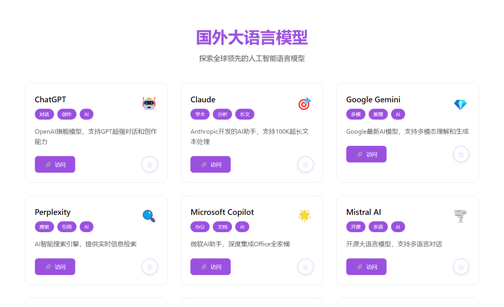

#### 3.1.3 偏好设置窗口

~~~rust
// 偏好设置窗口配置
{
    "width": 800,
    "height": 600,
    "decorations": true,
    "resizable": true,
    "title": "偏好设置",
    "label": "preferences",
    "visible": false,
    "center": true,
    "skipTaskbar": false,
    "alwaysOnTop": false,
    "focus": true,
    "transparent": false,
    "url": "index.html#/preferences"
}

// 偏好设置窗口创建
WindowBuilder::new(
    &app,
    "preferences",
    WindowUrl::App("index.html#/preferences".into())
)
.title("偏好设置")
.inner_size(800.0, 600.0)
.center()
.build()
.unwrap();

// 自定义窗口装饰
#[cfg(target_os = "windows")]
{
    use windows_sys::Win32::UI::WindowsAndMessaging::SetMenu;
    use windows_sys::Win32::Foundation::HWND;
    let hwnd = event.window().hwnd().unwrap().0 as HWND;
    unsafe {
        SetMenu(hwnd, 0); // 移除菜单栏，保留标题栏和控制按钮
    }
}
~~~

#### 3.1.4 偏好设置窗口展示
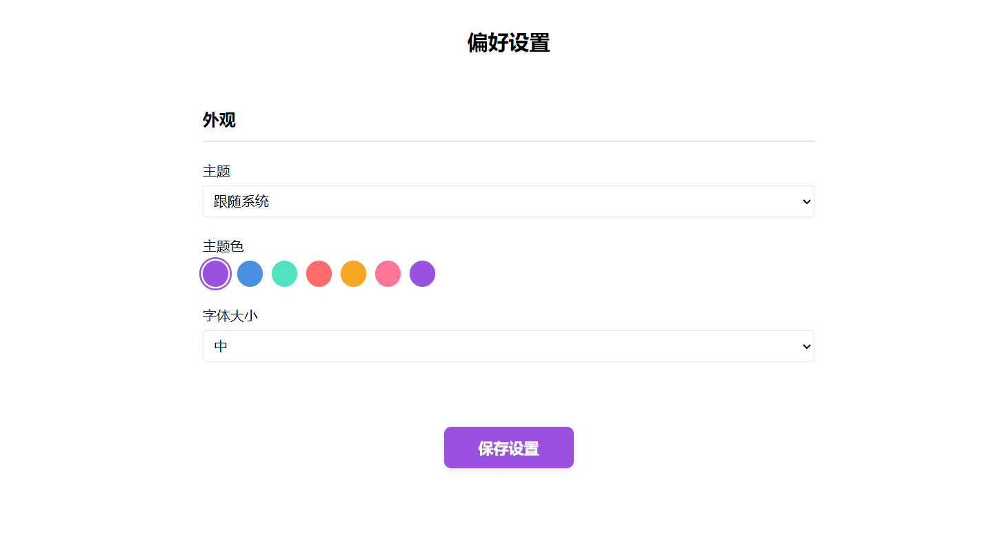


#### 3.1.5 窗口间通信机制

~~~rust
// 前端发送事件
import { emit } from '@tauri-apps/api/event'

// 发送主题变更事件
await emit('theme-changed', preferences.value)

// 发送字体大小变更事件
await emit('font-size-changed', preferences.value.fontSize)

// 监听事件
import { listen } from '@tauri-apps/api/event'

// 监听主题变更
unlistenTheme = await listen('theme-changed', event => {
    preferences.value = event.payload
    applyTheme(event.payload)
})

// 监听字体大小变更
unlistenFontSize = await listen('font-size-changed', event => {
    const savedPrefs = localStorage.getItem('preferences')
    if (savedPrefs) {
        const preferences = JSON.parse(savedPrefs)
        preferences.fontSize = event.payload
        localStorage.setItem('preferences', JSON.stringify(preferences))
    }
    applyFontSize(event.payload)
})
~~~

### 3.2 导航系统

+ 平台分类：
  + 国外大语言模型
  + 国内大语言模型
  + 多功能模型


+ 搜索功能：实时搜索和过滤
+ 收藏系统：本地收藏管理

#### 3.2.1 平台分类实现

~~~javascript
const sections = [
    {
        title: '国外大语言模型',
        category: 'foreignLLMs',
        description: '国际领先的AI语言模型平台',
        icon: '🌍'
    },
    {
        title: '国内大语言模型',
        category: 'domesticLLMs',
        description: '本土化优势的AI语言服务',
        icon: '🇨🇳'
    },
    {
        title: '多功能模型',
        category: 'multiModalModels',
        description: '集成多种AI能力的综合平台',
        icon: '🎯'
    }
]
~~~

#### 3.2.2 搜索和过滤系统

~~~javascript
const filterPlatforms = () => {
    let filteredPlatforms = platforms
    
    if (searchQuery.value) {
        const query = searchQuery.value.toLowerCase()
        filteredPlatforms = filteredPlatforms.filter(platform => 
            platform.name.toLowerCase().includes(query) ||
            platform.description.toLowerCase().includes(query) ||
            platform.tags.some(tag => tag.toLowerCase().includes(query))
        )
    }
    
    // 分类过滤
    if (selectedCategory.value !== 'all') {
        filteredPlatforms = filteredPlatforms.filter(
            platform => platform.category === selectedCategory.value
        )
    }
    
    return filteredPlatforms
}
~~~

#### 3.2.3 搜索和过滤系统展示
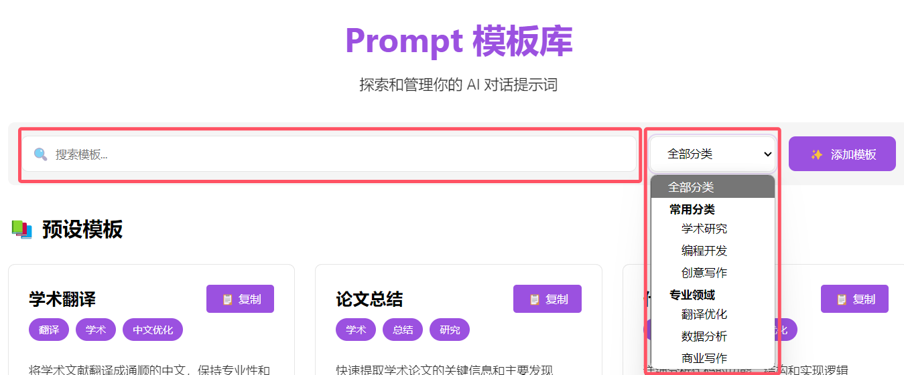

### 3.3 主题系统

+ 支持多主题切换（浅色/深色）

+ 系统主题跟随

+ 字体大小调整

#### 3.3.1 主题切换实现

~~~javascript
const applyTheme = (preferences) => {
    const theme = preferences.theme
    const prefersDark = window.matchMedia('(prefers-color-scheme: dark)').matches
    const isDark = theme === 'dark' || (theme === 'system' && prefersDark)
    
    document.documentElement.classList.toggle('dark-theme', isDark)
    if (isDark) {
        document.documentElement.style.setProperty('--bg-color', '#1a1a1a')
        document.documentElement.style.setProperty('--text-color', '#ffffff')
        document.documentElement.style.setProperty('--bg-gradient', '#2d2d2d')
    } else {
        document.documentElement.style.setProperty('--bg-color', '#ffffff') 
        document.documentElement.style.setProperty('--text-color', '#000000')
        document.documentElement.style.setProperty('--bg-gradient', '#f5f5f5')
    }
}
~~~

#### 3.3.2 主题切换展示
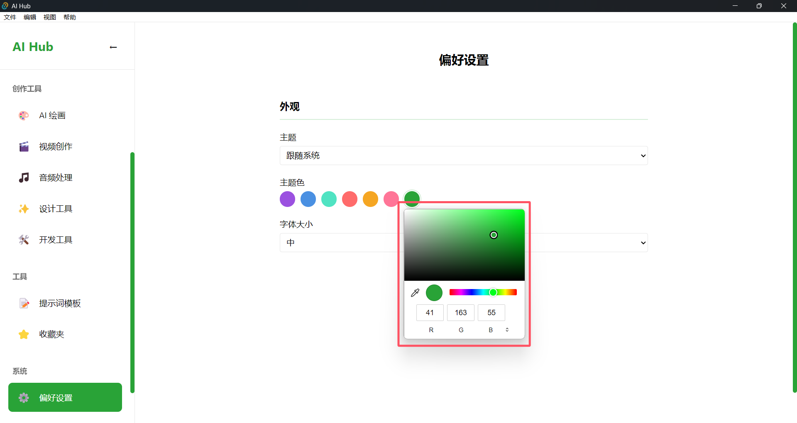

#### 3.3.3 字体系统

~~~javascript
const applyFontSize = (fontSize) => {
    const fontSizes = {
        small: '14px',
        medium: '16px',
        large: '18px'
    }
    const size = fontSizes[fontSize] || fontSizes.medium
    document.documentElement.style.setProperty('--base-font-size', size)
}
~~~

#### 3.3.4 字体切换展示


- 小号字体
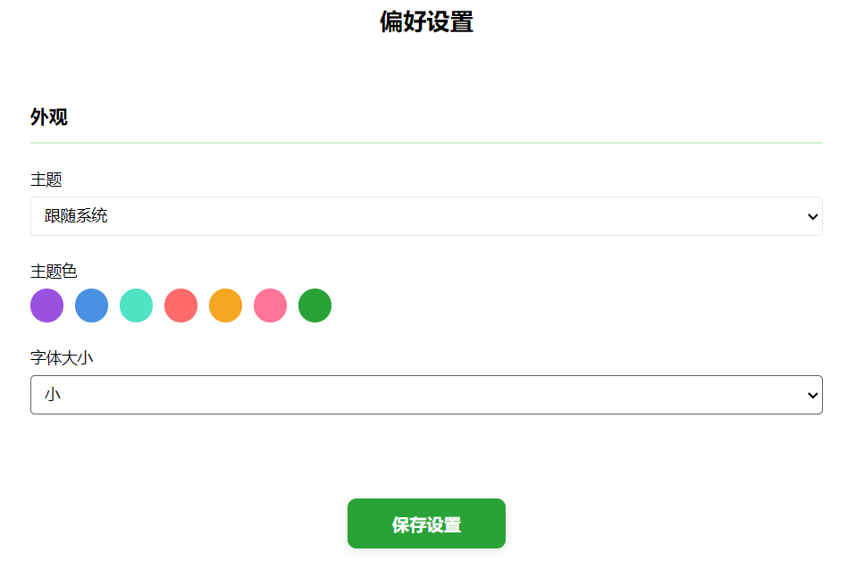

- 大号字体
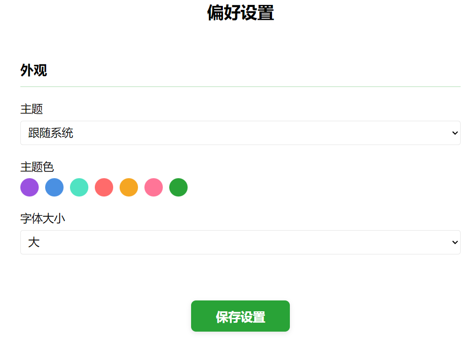

### 3.4 路由系统

#### 3.4.1 路由配置：
```javascript
const routes = [
  {
    path: '/',
    redirect: '/foreign-llm'
  },
  {
    path: '/foreign-llm',
    name: 'ForeignLLM',
    component: ForeignLLM
  },
  {
    path: '/domestic-llm',
    name: 'DomesticLLM',
    component: DomesticLLM
  },
  {
    path: '/multimodal-llm',
    name: 'MultimodalLLM',
    component: MultimodalLLM
  },
  {
    path: '/ai-drawing',
    name: 'AIDrawing',
    component: AIDrawing
  },
  {
    path: '/video-creation',
    name: 'VideoCreation',
    component: VideoCreation
  },
  {
    path: '/audio-processing',
    name: 'AudioProcessing',
    component: AudioProcessing
  },
  {
    path: '/design-tools',
    name: 'DesignTools',
    component: DesignTools
  },
  {
    path: '/dev-tools',
    name: 'DevTools',
    component: DevTools
  }
]
```

#### 3.4.2 路由导航守卫：
```javascript
router.beforeEach((to, from, next) => {
  // 路由切换前的处理
  document.title = `${to.name} - AI导航平台`
  next()
})
```

### 3.5 侧边栏系统

#### 3.5.1 侧边栏组件：
```vue
<template>
  <div class="sidebar" :class="{ 'collapsed': isCollapsed }">
    <div class="sidebar-header">
      <button @click="toggleSidebar">
        <icon name="menu" />
      </button>
    </div>
    <nav class="sidebar-nav">
      <router-link to="/foreign-llm">国外大语言模型</router-link>
      <router-link to="/domestic-llm">国内大语言模型</router-link>
      <router-link to="/multimodal-llm">多模态模型</router-link>
      <router-link to="/ai-drawing">AI绘画</router-link>
      <router-link to="/video-creation">视频创作</router-link>
      <router-link to="/audio-processing">音频处理</router-link>
      <router-link to="/design-tools">设计工具</router-link>
      <router-link to="/dev-tools">开发工具</router-link>
    </nav>
  </div>
</template>
```

#### 3.5.2 侧边栏展示
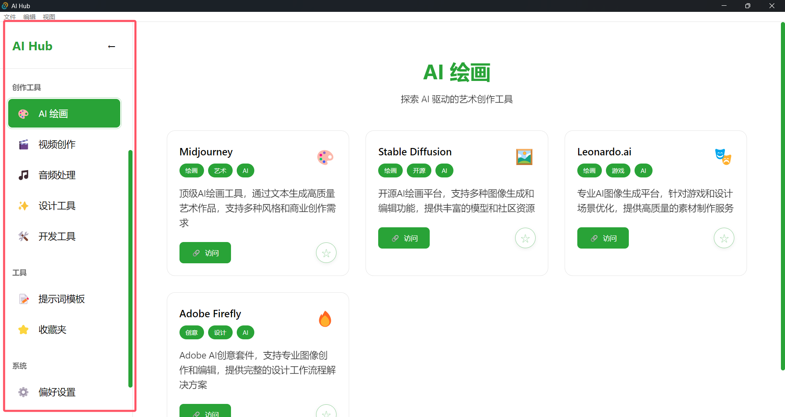

#### 3.5.3 响应式设计：
```css
.sidebar {
  width: var(--sidebar-width);
  height: 100vh;
  position: fixed;
  left: 0;
  top: 0;
  background: var(--bg-gradient);
  transition: all 0.3s ease;
}

.sidebar.collapsed {
  width: var(--sidebar-collapsed-width);
}

@media (max-width: 768px) {
  .sidebar {
    transform: translateX(-100%);
  }
  
  .sidebar.collapsed {
    transform: translateX(0);
  }
}
```

### 3.6 收藏系统

​	收藏系统允许用户保存和管理他们感兴趣的 AI 模型。系统主要包含以下功能:

#### 3.6.1 状态管理

​	使用 Vuex 进行收藏状态的集中管理:
```vue
const store = createStore({
  state: {
    favorites: JSON.parse(localStorage.getItem('favorites') || '[]')
  },
  mutations: {
    toggleFavorite(state, model) {
      const index = state.favorites.findIndex(f => f.name === model.name)
      if (index === -1) {
        state.favorites.push(model)
      } else {
        state.favorites.splice(index, 1)
      }
      // 保存到本地存储
      localStorage.setItem('favorites', JSON.stringify(state.favorites))
    }
  },
  getters: {
    isFavorite: (state) => (model) => {
      return state.favorites.some(f => f.name === model.name)
    }
  }
})
```

#### 3.6.2 收藏按钮组件

​	每个模型卡片都包含一个收藏按钮,样式会根据收藏状态动态变化:
```vue
.favorite-btn {
  background: rgba(255, 255, 255, 0.95);
  border: 1px solid var(--theme-color);
  color: var(--theme-color);
  opacity: 0.5;
  cursor: pointer;
  transition: all 0.3s ease;
  /* ... 其他样式 ... */
}

.favorite-btn.active {
  background: var(--theme-color);
  color: white;
  border-color: var(--theme-color);
  opacity: 1;
  box-shadow: 0 2px 8px var(--theme-color-light);
}
```
- 未收藏
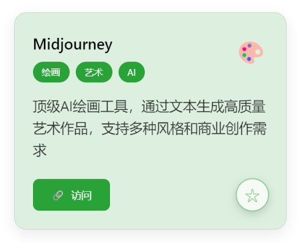

- 已收藏
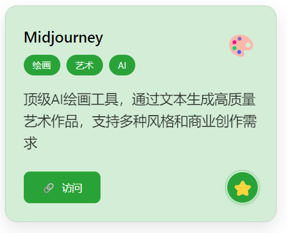

#### 3.6.3 收藏页面
```vue
<template>
  <div class="favorites">
    <div class="header">
      <h1>我的收藏</h1>
      <p>管理你收藏的 AI 模型</p>
    </div>

    <div class="model-grid" v-if="favorites.length > 0">
      <!-- 收藏的模型列表 -->
    </div>

    <!-- 空状态提示 -->
    <div v-else class="empty-state">
      <div class="empty-icon">⭐</div>
      <h3>暂无收藏</h3>
      <p>你还没有收藏任何 AI 模型</p>
      <router-link to="/" class="browse-btn">
        浏览模型
      </router-link>
    </div>
  </div>
</template>
```
#### 3.6.4 收藏页面展示
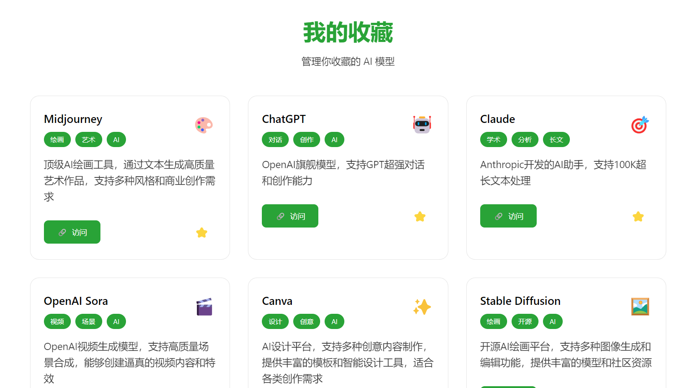

#### 3.6.5 本地持久化

​	收藏数据通过 localStorage 实现本地持久化存储:

- 当用户进行收藏操作时,数据会被同步到 localStorage
- 应用启动时会从 localStorage 读取收藏数据
- 确保用户的收藏在刷新页面后仍然保持

#### 3.6.6 跨组件状态共享

通过 Vuex 的 mapGetters 和 mapMutations 在各组件中复用收藏相关的方法:
```vue
export default {
  computed: {
    ...mapGetters(['isFavorite'])
  },
  methods: {
    ...mapMutations(['toggleFavorite']),
    handleFavorite(model) {
      this.toggleFavorite({
        ...model,
        category: 'domestic-llm'
      })
    }
  }
}
```

### 3.7 提示词模板系统

​	提示词模板系统为用户提供了预设的提示词模板,帮助用户更好地与AI模型进行交互。系统包含以下核心功能:

#### 3.7.1 模板管理

​	提示词模板的状态管理实现:
```javascript
const store = createStore({
  state: {
    templates: JSON.parse(localStorage.getItem('promptTemplates') || '[]'),
    categories: [
      { id: 'writing', name: '写作辅助' },
      { id: 'translation', name: '翻译助手' },
      { id: 'coding', name: '编程开发' },
      { id: 'analysis', name: '数据分析' },
      { id: 'custom', name: '自定义' }
    ]
  },
  mutations: {
    addTemplate(state, template) {
      state.templates.push({
        id: Date.now(),
        ...template,
        createTime: new Date().toISOString()
      })
      this.commit('saveTemplates')
    },
    deleteTemplate(state, id) {
      const index = state.templates.findIndex(t => t.id === id)
      if (index > -1) {
        state.templates.splice(index, 1)
        this.commit('saveTemplates')
      }
    },
    saveTemplates(state) {
      localStorage.setItem('promptTemplates', JSON.stringify(state.templates))
    }
  }
})
```

#### 3.7.2 提示词模板页面展示
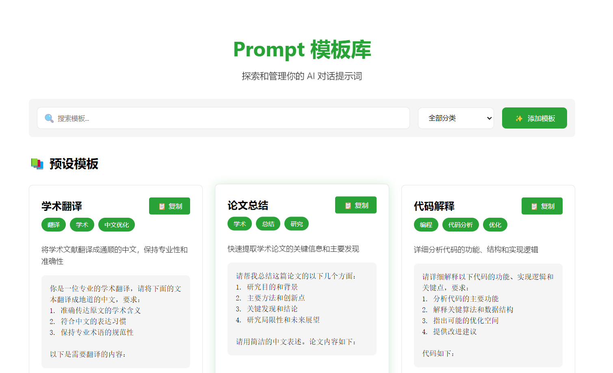

#### 3.7.3 模板编辑器

​	提供直观的模板编辑界面:
```vue
<template>
  <div class="prompt-editor">
    <div class="editor-header">
      <input 
        v-model="template.name" 
        placeholder="模板名称"
        class="template-name"
      />
      <select v-model="template.category">
        <option v-for="cat in categories" :key="cat.id" :value="cat.id">
          {{ cat.name }}
        </option>
      </select>
    </div>

    <div class="editor-body">
      <textarea
        v-model="template.content"
        placeholder="在此输入提示词模板..."
        class="template-content"
      />
      
      <div class="variable-list">
        <div v-for="(variable, index) in template.variables" 
             :key="index"
             class="variable-item">
          <input v-model="variable.name" placeholder="变量名" />
          <input v-model="variable.description" placeholder="描述" />
          <button @click="removeVariable(index)">删除</button>
        </div>
        <button @click="addVariable">添加变量</button>
      </div>
    </div>

    <div class="editor-footer">
      <button @click="saveTemplate">保存模板</button>
      <button @click="previewTemplate">预览效果</button>
    </div>
  </div>
</template>
```

#### 3.7.4 模板编辑器展示
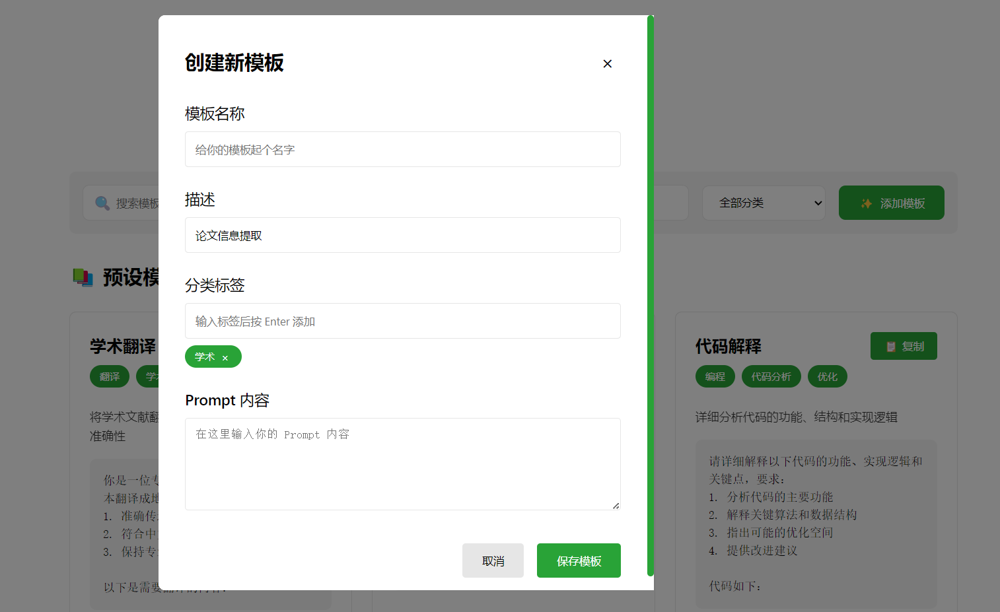

#### 3.7.5 模板分类

​	按功能对模板进行分类管理:
```vue
<template>
  <div class="template-list">
    <div class="category-tabs">
      <div v-for="category in categories" 
           :key="category.id"
           :class="['tab', { active: currentCategory === category.id }]"
           @click="currentCategory = category.id">
        {{ category.name }}
      </div>
    </div>

    <div class="templates-container">
      <div v-for="template in filteredTemplates" 
           :key="template.id"
           class="template-card">
        <h3>{{ template.name }}</h3>
        <p>{{ template.description }}</p>
        <div class="template-actions">
          <button @click="useTemplate(template)">使用</button>
          <button @click="editTemplate(template)">编辑</button>
          <button @click="deleteTemplate(template.id)">删除</button>
        </div>
      </div>
    </div>
  </div>
</template>
```

## 4. 前端实现

​	本章节描述了应用的前端实现细节，包括界面设计、组件系统和状态管理。采用Vue.js框架，结合现代化的UI设计理念，实现了响应式布局、主题切换、组件复用等特性，确保了良好的用户体验。

### 4.1 界面设计

+ 响应式布局
+ 卡片式展示
+ 动画过渡效果
+ 渐变色主题

#### 4.1.1 响应式布局

~~~vue
.card-container {
    display: grid;
    grid-template-columns: repeat(auto-fill, minmax(280px, 1fr));
    gap: 25px;
    padding: 20px;
}

@media (max-width: 768px) {
    .card-container {
        grid-template-columns: 1fr;
    }
}
~~~

#### 4.1.2 动画效果

~~~vue
.card {
    transition: all 0.4s cubic-bezier(0.4, 0, 0.2, 1);
}

.card:hover {
    transform: translateY(-5px) scale(1.02);
    box-shadow: 0 8px 25px rgba(155, 81, 224, 0.15);
}
~~~


### 4.2 组件系统

+ Home.vue：主页面组件
+ Preferences.vue：偏好设置组件
+ 自适应组件设计

#### 4.2.1 Home.vue 主页面组件

~~~vue
// src/components/Home.vue
<template>
  <div class="home">
    <!-- 头部搜索和筛选 -->
    <div class="toolbar">
      <div class="search-box">
        <input type="text" v-model="searchQuery" placeholder="搜索平台...">
      </div>
      <div class="filter-box">
        <select v-model="selectedCategory">
          <option value="all">全部分类</option>
          <!-- 其他分类选项 -->
        </select>
      </div>
    </div>

    <!-- 平台展示区域 -->
    <div class="sections">
      <div v-for="section in filteredSections" :key="section.title">
        <!-- 分类标题 -->
        <div class="section-header">
          <h2>{{ section.title }}</h2>
          <p>{{ section.description }}</p>
        </div>
        
        <!-- 平台卡片网格 -->
        <div class="card-container">
          <div v-for="platform in filterPlatformsBySection(section.category)"
               :key="platform.name"
               class="card"
               @click="openUrl(platform.url)">
            <!-- 卡片内容 -->
          </div>
        </div>
      </div>
    </div>
  </div>
</template>

<script>
export default {
  name: 'Home',
  setup() {
    // 状态管理
    const searchQuery = ref('')
    const selectedCategory = ref('all')
    const showFavoritesOnly = ref(false)
    
    // 平台数据和过滤逻辑
    const filterPlatformsBySection = (category) => {
      // 实现平台过滤逻辑
    }
    
    // 事件处理
    const openUrl = (url) => {
      window.open(url, '_blank')
    }
    
    return {
      searchQuery,
      selectedCategory,
      filterPlatformsBySection,
      openUrl
    }
  }
}
</script>
~~~

#### 4.2.2 Preferences.vue 偏好设置组件

~~~vue
// src/components/Preferences.vue
<template>
  <div class="preferences-container">
    <h1>偏好设置</h1>
    
    <!-- 主题设置 -->
    <div class="section">
      <h2>外观</h2>
      <div class="option">
        <label for="theme">主题</label>
        <select v-model="preferences.theme" @change="applyTheme">
          <option value="light">浅色</option>
          <option value="dark">深色</option>
          <option value="system">跟随系统</option>
        </select>
      </div>
      
      <!-- 字体大小设置 -->
      <div class="option">
        <label for="fontSize">字体大小</label>
        <select v-model="preferences.fontSize" @change="applyFontSize">
          <option value="small">小</option>
          <option value="medium">中</option>
          <option value="large">大</option>
        </select>
      </div>
    </div>
    
    <!-- 保存按钮 -->
    <div class="button-container">
      <button @click="savePreferences">保存设置</button>
    </div>
  </div>
</template>

<script>
export default {
  name: "Preferences",
  setup() {
    const preferences = ref({
      theme: "system",
      fontSize: "medium"
    })
    
    // 主题应用
    const applyTheme = () => {
      const theme = preferences.value.theme
      const prefersDark = window.matchMedia("(prefers-color-scheme: dark)").matches
      const isDark = theme === "dark" || (theme === "system" && prefersDark)
      // 应用主题样式
    }
    
    // 字体大小应用
    const applyFontSize = () => {
      const fontSizes = {
        small: "14px",
        medium: "16px",
        large: "18px"
      }
      // 应用字体大小
    }
    
    // 保存设置
    const savePreferences = async () => {
      localStorage.setItem("preferences", JSON.stringify(preferences.value))
      await emit('theme-changed', preferences.value)
      await emit('font-size-changed', preferences.value.fontSize)
    }
    
    return {
      preferences,
      applyTheme,
      applyFontSize,
      savePreferences
    }
  }
}
</script>
~~~

#### 4.2.3 自适应组件设计

~~~javascript
/* 响应式布局 */
@media (max-width: 1400px) {
  .card-container {
    grid-template-columns: repeat(3, 1fr);
  }
}

@media (max-width: 1024px) {
  .card-container {
    grid-template-columns: repeat(2, 1fr);
  }
}

@media (max-width: 768px) {
  .card-container {
    grid-template-columns: 1fr;
  }
  
  .toolbar {
    flex-direction: column;
  }
  
  .search-box,
  .filter-box select {
    width: 100%;
  }
}

/* 自适应字体大小 */
:root {
  --base-font-size: 16px;
}

@media (max-width: 768px) {
  :root {
    --base-font-size: 14px;
  }
}

/* 自适应间距 */
.card {
  padding: clamp(15px, 3vw, 25px);
}

/* 自适应图标 */
.card-icon {
  font-size: clamp(2em, 4vw, 3em);
}
~~~

### 4.3 状态管理

+ 本地存储集成
+ 主题状态管理
+ 收藏状态管理

#### 4.3.1 本地存储管理

1. 用户偏好设置存储
```javascript
const preferences = ref({
theme: "system",
fontSize: "medium",
themeColor: "#9B51E0"
})

const savePreferences = async () => {
try {
localStorage.setItem('preferences', JSON.stringify(preferences.value))
await emit('theme-changed', preferences.value)
await emit('font-size-changed', preferences.value.fontSize)
await emit('theme-color-changed', preferences.value.themeColor)
} catch (error) {
console.error('保存设置失败:', error)
}
}
```

2. 收藏夹数据存储
```javascript
const store = createStore({
  state() {
    return {
      favorites: JSON.parse(localStorage.getItem('favorites') || '[]')
    }
  },
  mutations: {
    toggleFavorite(state, model) {
      const index = state.favorites.findIndex(f => f.name === model.name)
      if (index === -1) {
        state.favorites.push(model)
      } else {
        state.favorites.splice(index, 1)
      }
      localStorage.setItem('favorites', JSON.stringify(state.favorites))
    }
  },
  getters: {
    isFavorite: (state) => (model) => {
      return state.favorites.some(f => f.name === model.name)
    }
  }
})
```

#### 4.3.2 主题状态管理

1. 主题切换实现
```javascript
const applyTheme = () => {
  const theme = preferences.value.theme
  const prefersDark = window.matchMedia('(prefers-color-scheme: dark)').matches
  const isDark = theme === 'dark' || (theme === 'system' && prefersDark)
  
  document.documentElement.classList.toggle('dark-theme', isDark)
  if (isDark) {
    document.documentElement.style.setProperty('--bg-color', '#1a1a1a')
    document.documentElement.style.setProperty('--text-color', '#ffffff')
    document.documentElement.style.setProperty('--bg-gradient', '#2d2d2d')
  } else {
    document.documentElement.style.setProperty('--bg-color', '#ffffff') 
    document.documentElement.style.setProperty('--text-color', '#000000')
    document.documentElement.style.setProperty('--bg-gradient', '#f5f5f5')
  }
}
```

2. 主题色管理
```javascript
const applyThemeColor = () => {
  const color = preferences.value.themeColor
  document.documentElement.style.setProperty('--theme-color', color)
  document.documentElement.style.setProperty('--theme-color-light', color + '33')
  
  // 转换颜色为RGB格式
  const rgb = color.replace('#', '').match(/.{2}/g)
    .map(x => parseInt(x, 16)).join(', ')
  document.documentElement.style.setProperty('--theme-color-rgb', rgb)
}
```

#### 4.3.3 事件监听管理

1. 组件挂载时的事件监听
```javascript
onMounted(async () => {
  // 加载偏好设置
  loadPreferences()
  
  // 监听系统主题变化
  const cleanup = watchSystemTheme()
  
  // 监听主题相关事件
  unlistenTheme = await listen('theme-changed', event => {
    preferences.value = event.payload
    applyTheme()
  })
  
  unlistenFontSize = await listen('font-size-changed', event => {
    preferences.value.fontSize = event.payload
    applyFontSize()
  })
  
  unlistenThemeColor = await listen('theme-color-changed', event => {
    preferences.value.themeColor = event.payload
    applyThemeColor()
  })
})
```

2. 系统主题监听
```javascript
const watchSystemTheme = () => {
  const mediaQuery = window.matchMedia('(prefers-color-scheme: dark)')
  const handleChange = () => {
    if (preferences.value.theme === 'system') {
      applyTheme()
    }
  }
  mediaQuery.addEventListener('change', handleChange)
  return () => mediaQuery.removeEventListener('change', handleChange)
}
```

#### 4.3.4 Vuex 状态管理

1. Store 配置
```javascript
const store = createStore({
  state() {
    return {
      favorites: JSON.parse(localStorage.getItem('favorites') || '[]')
    }
  },
  mutations: {
    toggleFavorite(state, model) {
      const index = state.favorites.findIndex(f => f.name === model.name)
      if (index === -1) {
        state.favorites.push(model)
      } else {
        state.favorites.splice(index, 1)
      }
      localStorage.setItem('favorites', JSON.stringify(state.favorites))
    }
  },
  getters: {
    isFavorite: (state) => (model) => {
      return state.favorites.some(f => f.name === model.name)
    }
  }
})
```

## 5. 系统特性

​	本章节阐述了系统的核心特性，包括性能优化、用户体验和安全特性。通过Rust的零成本抽象、异步事件处理和资源懒加载等技术，实现了高性能、流畅的用户体验，同时确保了应用的安全性。

### 5.1 性能优化

+ Rust 原生性能：利用 Rust 的零成本抽象和内存安全特性

1. 零成本抽象

~~~rust
// 在 lib.rs 中的窗口管理实现
pub fn run() {
    // Rust的所有权系统确保内存安全，无需垃圾回收
    let main_menu = Menu::new()
        .add_submenu(file_menu)
        .add_submenu(edit_menu);
    
    // 编译时类型检查，运行时零开销
    #[cfg(target_os = "windows")]
    {
        use windows_sys::Win32::UI::WindowsAndMessaging::{GetMenu, HMENU};
        // 直接操作系统API，无额外开销
    }
}
~~~

2. 内存安全特性

~~~rust
// 自动内存管理
static MAIN_MENU: std::sync::atomic::AtomicIsize = std::sync::atomic::AtomicIsize::new(0);

// 线程安全的原子操作
unsafe {
    MAIN_MENU.store(menu as isize, std::sync::atomic::Ordering::SeqCst);
}
~~~

+ 异步事件处理：使用 Tauri 的异步事件系统

1. Tauri 事件系统

~~~javascript
// 异步事件监听
.on_window_event(|event| {
    if event.window().label() == "preferences" {
        // 异步处理窗口事件
    }
})

// 菜单事件异步处理
.on_menu_event(|event| {
    match event.menu_item_id() {
        "preferences" => {
            // 异步创建窗口
        }
        // ...
    }
})
~~~

2. 前端事件处理

~~~javascript
// Vue组件中的异步事件监听
onMounted(async () => {
    // 异步加载主题设置
    loadPreferences();
    
    // 异步监听主题变更
    unlistenTheme = await listen('theme-changed', event => {
        applyTheme(event.payload);
    });
});
~~~

+ 资源懒加载：按需加载组件和资源

1. 组件按需加载

~~~rust
// 路由配置中的懒加载
const routes = [
    {
        path: '/preferences',
        component: () => import('./components/Preferences.vue')
    }
];
~~~

2. 资源动态加载

~~~rust
// 平台数据动态加载
const platforms = ref([]);
const loadPlatforms = async () => {
    // 按需加载平台数据
    platforms.value = await fetchPlatforms();
};
~~~

### 5.2 用户体验

+ 流畅动画：使用 CSS transitions 和 transforms 实现平滑过渡
+ 响应式设计：适配不同屏幕尺寸
+ 主题切换：支持明暗主题和系统主题跟随

### 5.3 安全特性

+ CSP 策略：严格的内容安全策略
+ 权限控制：精确的功能权限管理
+ 安全通信：安全的跨进程通信机制

## 6. 项目总结

​	在本章节中，我们将对整个项目进行全面的总结和回顾，重点介绍项目的亮点、开发成果以及项目的实际价值。通过对这些方面的详细分析，我们希望能够为读者提供一个清晰的项目全貌，并展示项目在技术、功能和用户体验等方面的独特优势。

### 6.1 项目亮点

​	本项目从技术、功能、用户体验和架构四个维度展现了独特的创新性和优势：

1. **技术特色：**

+ 采用 Rust + Tauri 的新型桌面应用开发方案
+ 实现了原生窗口管理和系统集成
+ 使用现代化的前端框架和工具链

2. **功能特色：**

+ 统一的大语言模型访问入口
+ 智能的平台分类和搜索系统
+ 个性化的主题和字体设置

3. **用户体验特色：**

+ 现代化的 UI 设计
+ 流畅的动画效果
+ 直观的操作方式

4. **架构特色：**

+ 前后端分离架构
+ 模块化的代码组织
+ 可扩展的插件系统

### 6.2 开发成果

1. **技术实现**
- 成功构建了基于 Rust 和 Tauri 的现代桌面应用
- 实现了与 Windows 系统的深度集成
- 开发了响应式的用户界面和完整的功能模块

2. **目标达成**
- 提供了统一的大语言模型访问平台
- 解决了用户在使用多个 AI 工具时的痛点
- 实现了良好的用户体验和系统性能

### 6.3 项目价值

1. **技术价值**
- 探索了 Rust 在桌面应用开发中的应用
- 实践了现代化的前端开发方案
- 积累了系统软件开发的经验

2. **应用价值**
- 提高了用户使用 AI 工具的效率
- 降低了多平台切换的成本
- 优化了用户的使用体验

### 6.4 未来展望

1. **功能扩展**
- 增加更多 AI 平台的支持
- 开发更多个性化功能
- 提供更丰富的定制选项

2. **技术优化**
- 进一步提升系统性能
- 增强跨平台兼容性
- 完善安全性机制

3. **生态建设**
- 开发插件系统
- 建立用户反馈机制
- 构建开发者社区